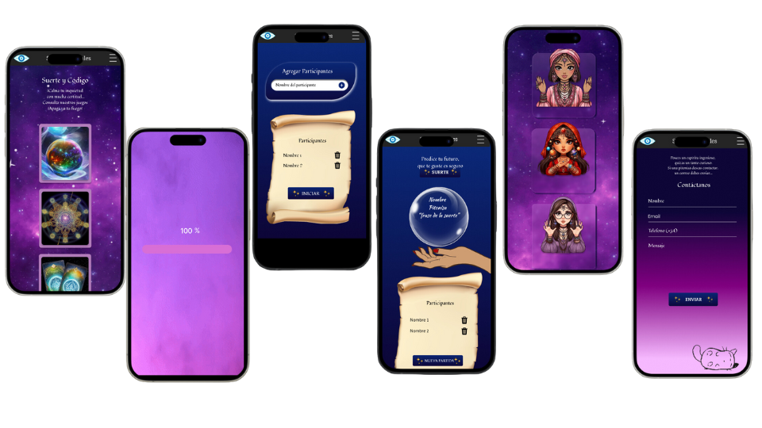

# P4_J1_Random_Lucky

## PROFESSIONAL OBJECTIVE
Develop static and animated web pages using HTML, CSS and Javascript.

## PEDAGOGICAL OBJECTIVE  
To develop sufficient knowledge for the use of javascript in dynamic web pages:
- Apply fundamental javascript concepts.
- Manipulate the DOM by accessing HTML elements in order to modify their attributes.
- Manage events associated with HTML elements to handle smooth user interaction.
fluid interaction with the user.

## CONTEXT / NEED
Carnival DOM Games Company, needs to develop a game called RANDOM LUCKY. Developers will have the opportunity to immerse themselves in a dynamic and collaborative work environment, contributing their talent and creativity that will drive Carnival DOM's success in the digital games industry.

## Requirements
### Minima
The application must allow:
- Names to be entered into a list.
- Have a collection of lucky messages.
- Have the functionality of random selection of a name from the list.
- Display a "lucky" prompt for the selected name.
- Have the functionality to remove from the list names that have already been
- Have the functionality to remove names that have already been fortunetold.
- Have the functionality to manually add or remove names on the front end.

### Extras
- Store in the localstorage the list of people who have not had their fortunes read.

## Process 
### Tecnologies
For this project we used the technologies requested:

### Mockups 

### Responsive web desing
The game has four controlled views for responsive web design:
- Mobile (414 x 896)
- Tablet (834 x 1112)
- Desktop 1 (1280 x 800)
- Desktop 2 (1366 x 768)

### Page Deployment
[Secretos Astrales](https://secretosastrales.netlify.app/)

## To Improve in the Future
- Making a responsive design that encompasses more.

## Installations Steps
1. [Clone](https://docs.github.com/en/repositories/creating-and-managing-repositories/cloning-a-repository) the repository.

2. Open the proyect in Visual Studio Code ( is a source code editor developed by Microsoft for Windows, Linux, macOS and Web).

3. Enjoy it.

## Authors 
created with 💜 for:
- [Johana](https://github.com/Sandovaljohana)
- [Ana C](https://github.com/AnaCe-7)
- [Alejandra](https://github.com/alejapamplona)
- [Sharon](https://github.com/sharonSofia)
- [Nathalia](https://github.com/NathaRuiz)

